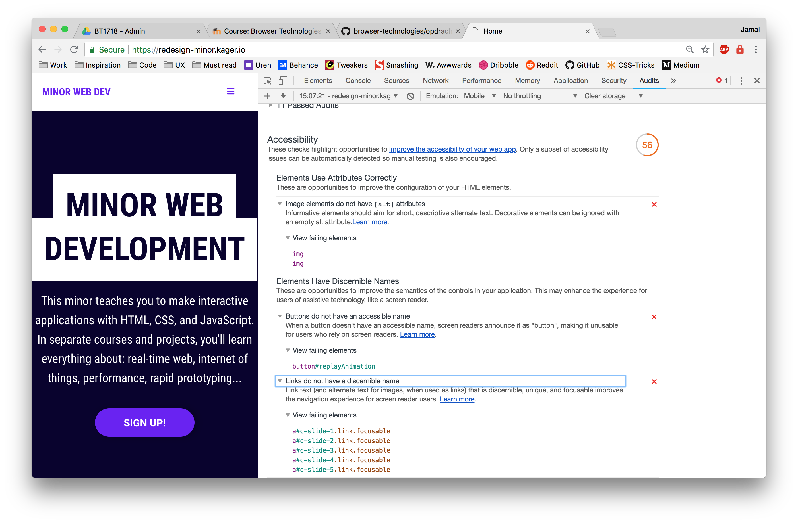

# Browser Technologies
// Robuuste, toegankelijke websites leren bouwen … 


## Opdracht 1 - Progressive Enhancement

Voor deze opdracht ga ik mijn meesterproef gebruiken. Op dit moment is dat het enige project dat af genoeg is om goed mee aan de slag te kunnen. Voor het overgrote deel zal ik de homepagina gebruiken als maatstaaf voor deze opdracht.


### Project - [Plezierige minor website](https://redesign-minor.kager.io/)

#### 1. Afbeeldingen

##### 1.1 Met afbeeldingen

De website gebruikt over het algemeen (nog) niet heel veel grote afbeeldingen. Wel zijn er veel secties met veel kleine afbeeldingen. Deze worden vooral gebruikt om een impressie te geven over een bepaald onderdeel. Op de homepagina zijn de images niet mega groot, maar nemen wel het meeste in beslag (grootste afbeelding is 186kb). De images zouden nog extra gecomprimeerd kunnen worden om nog meer ruimte te besparen. Daartegenover kan dit wel ten koste gaan van de kwaliteit. Het is daarom belangrijk om een goede balans te vinden tussen kwaliteit en performance. 


##### 1.2 Zonder afbeeldingen

Zonder afbeeldingen werkt de website over het algemeen nog erg goed. Op de homepagina missen de afbeeldingen bij de vakken alleen een `alt` tag. Voor screenreaders zal het dus onduidelijk zijn wat voor afbeeldingen hier dan terechtkomen. De afbeeldingen bij de partners veranderen door de basis styling in klikbare grijze blokken. Zonder de `alt` tag is het voor iedereen onduidelijk wat deze blokken überhaupt bieden. Ook klikbare pijltjes aan de zijkant staan er niet meer, waardoor de functionaliteit van de partner slider compleet breekt.


#### 2. Custom fonts

De website laad zeker een custom font in. Dit is 'Robot Condensed' met Sans-serif als fallback. Er wordt ook gebruik gemaakt van het icon font 'Font Awesome'. Beide fonts worden ingeladen via een CDN link. Wanneer ik de custom fonts disable werkt alles nog steeds naar behoren. De website ziet er qua styling alleen wat saaier uit. Het grootste verschil zal zijn tussen de browser omdat ze allemaal een ander systeemfont gebruiken.


##### 2.1 Best practices voor custom fonts:

- Icon fonts vervangen voor SVG.
- Font subsetting <https://www.fontsquirrel.com/tools/webfont-generator>.
- Fallback gebruiken en die juist vormgeven (<https://github.com/bramstein/fontfaceobserver> or font-display).
- Only .woff and .woff2 als format om de load pagina niet lager te maken dan dat nodig is.


#### 3. Javascript

Frontend Javascript is niet de core van de website en de website zal daarom tot op zekere hoogte altijd blijven werken. Het grootste puntje van kritiek is de animatie van de header op de homepagina. Wanneer javascript uitstaat krijg je een header te zien die heel kaal is vormgegeven. Gelukkig heeft het element wel wat basis styling en is het bruikbaar. Het ziet er alleen niet heel mooi uit.

Ook de stortkey functionaliteit werkt niet meer, terwijl de indicators er staan alsof het wél werkt. Dit zou opgelost kunnen worden door de indicators te injecteren met Javascript in plaats van ze al statisch in de html te plaatsen of door een `.active` class mee te geven wanneer het script wordt geactiveerd.

```javascript
let mainIndicator = document.getElementById("keynav");
let menuIndicators = document.querySelectorAll(".main-nav div > ul a span");

if (keyNav.keyNavState === true) {
    this.mainIndicator.classList.add("active");
    this.menuIndicators.forEach(function(indicator) {
        indicator.classList.add("active");
    });
}
```


#### 4. Kleur

De website gebruikt erg veel verschillende kleuren. Voor mensen met kleurenblindheid zorgt dit er vooral voor dat de ervaring van de website simpelweg minder wordt. De verschillende vakken hebben namelijk allemaal een eigen kleur. Dit is gedaan om de vakken wat meer een eigen indentiteit te geven. Gelukkig heeft elk vak in de toekomst een eigen icoon/logo, waardoor ook mensen met kleurenblindheid iets hebben (naast kleur) om een vak mee de indentificeren.


Als goed is, is er overal op de website ook rekening gehouden met een minimaal contrast van `4.5/1`. Dit is de minimumwaarde om een goed contrast te creëren voor leesbaarheid. Dit heb ik gecheckt door de kleurwaardes in te voeren op een website zoals [contrastchecker](https://webaim.org/resources/contrastchecker/).

##### 4.2 Best practises

- Zorg voor een goed kleurencontrast met een minimale waarde van `4.5/1`.
- Laat je website/functionaliteit/design niet afhangen van kleurenhiërarchie. Doe je dit wel, gebruik hier dan een label of iets dergelijks bij.
- Laat de betekenis van kleuren niet bepalend zijn voor bepalde elementen. Bijvoorbeeld: Groen staat voor goed en rood staat voor fout.


#### 5. Breedband internet

De animatie op de homepagina is alleen leuk wanneer je ook daadwerkelijk op een groot scherm zit. Omdat de animatie op de code editor niet in het scherm past, is het super onduidelijk wat er allemaal gebeurt op het scherm.

Zoals eerder benoemd bij het kopje [afbeeldingen](#1.-afbeeldingen), missen veel afbeeldingen nog de juiste `alt` teksten. Ook moeten er bij veel `<a href"#">PLAATS HIER EEN TEKST</a>` nog teksten geplaatst worden. Sommige afbeeldingen staan tussen `<a>` tags, maar bevatten verder geen tekst. Voor screenreaders zal het onduidelijk zijn wat de links bevatten.




#### 6. Cookies

In dit project wordt er geen gebruikt gemaakt van cookies. Het heeft daarom geen zin om hier verder naar te kijken.


#### 7. Local Storage

De website maakt gebruikt van `localStorage`. De state van de custom acceskeys/hotkeys wordt hier in opgeslagen. Over het algemeen werkt `localStorage` erg stabiel. Al zijn er zeker wel wat problemen waar het tegenaan zou kunnen lopen volgens [caniuse](https://caniuse.com/#search=localstorage).

```javascript
const storage = {
    // Store data in localstorage
    store: function(key, data) {
        // create string from value so we can convert it back to js later.
        localStorage.setItem(key, JSON.stringify(data));
    },

    // Getting data from the localstorage
    get: function(key) {
        let data = localStorage.getItem(key);
        return JSON.parse(data);
    }
};
```

- Op IE8 en IE9 zijn er security issues omdat data tussen HTTP en HTTPS wordt gedeeld.
- Storage event werkt verkeerd in IE10 & IE11 omdat ze het verkeerd geïmplementeerd hebben.
- IE11 synced de data niet op de juiste manier tussen verschillende windows.


Zolang `localStorage` toegankelijk genoeg is werkt de functionaliteit. Gelukkig is niet de hele website gebouwt op `localStorage`. De basisfunctionaliteit zal daarom altijd werken. Alleen is het minder toegankelijk voor mensen met een fysieke beperking die toch wel heel graag hotkeys willen hebben.


#### 8. Muis/trackpad disabled

Hier is de website eigenlijk stiekem een beetje voor gemaakt. In ieder geval voor beperkt gebruikt van de muis & trackpad. De website is helemaal te gebruiken met `tab` en heeft zelfs functionalieit om sneller te navigeren door de website via de getallen 1 t/m 6. Wanneer je met spatie naar beneden scrollt, zal de `:focus` state ook meebewegen aan de hand van jouw scrollpositie. Ook is er een **skip to content** knop voor wanneer je de eerste keer op `tab` drukt. Op deze manier kunnen mensen met bijvoorbeeld screenreaders snel navigeren naar de content.

De website bevat ook custom hover states. Geen zorgen, we hebben alleen de standaard outline veranderd naar een blauwe `box-shadow: inset;`. Het idee en de functionaliteit is praktisch hetzelfde, alleen gaat de nieuwe 'outline' wel mee met de border-radius van een element.


De **skip to content** knop is zo gestijld dat de screenreader het element alsnog kan zien, zonder dat die visueel zichtbaar is.

```scss
  .skip-to-content {
    position: absolute;
    padding: .5rem 1rem;
    background-color: purple;
    color: #fff;
    border-radius: rem(50);
    width: 1px;
    height: 1px;
    margin: 0;
    clip: rect(1px, 1px, 1px, 1px);
  }
```


#### Testen in het device lab

Vervolgens ben ik gaan testen in het devicelab. Helaas deden maar twee apparaten het. De rest ging niet aan, was locked of de batterij was op. 

Bij het eerste device deed het menu het niet helemaal lekker. Dit was een bekende bug, waar de het click event niet wordt getriggered wanneer je op het menu icoontje drukt. Ook de schaalbaarheid van de headers gingen niet helemaal lekker. Veel content drukt de breedte van de website naar buiten. 


Bij het tweede device deed het menu het wel. Alleen omdat hier ook de content naar buiten gedrukt werd door de brede headers, viel het hamburger menu net buiten het scherm. Wanneer het menu eenmaal was uitgeklapt, was het menu eigenlijk te groot voor het scherm. Als je naar beneden scrollt, zag je ook dat het menu een fixt hoogte had en de website onderdoor ook verder scrollde. 


#### Screenreader.

Het begin van de website gaat best soepel met screenreader. Alleen moeten de getallen die naast de menu items staan niet opgelezen worden. Ook het editable begin in de hero header wordt helemaal voorgelezen door de screenreader. De links die bij de courses staan aangegeven zijn wel soepel gedaan. De `<a>` tag heeft daar onzichtbare tekst die goed te lezen is voor de screenreader, maar niet visueel zichtbaar is voor de standaard gebruiker, maar toch klikbaar is adhv CSS styling die over de gehele container gaat.

De afbeeldingen bij de partners missen `alt` tags, waardoor het onduidelijk is voor de gebruiker wat er gebeurt. Bij de instagram sectie zijn er wel `alt` tags toegevoegd om het meteen duidelijk te maken waar de afbeelding over gaat.

- Bij de links van de vakken mag er wel wat meer content opgelezen worden. Er staan nu alleen links die qua idee erg goed zijn, maar weinig verder duidelijk maken voor de gebruiker.
- Letterlijk alles wordt meteen opgelezen wanneer je de text-editor in gaat. Het mag wel wat duidelijker zijn wat je er mee kan.
- De getallen naast de links hoeven niet opgenoemd te worden. De screenreader leest ook zelf al of er acceskeys op zitten (yes, die zitten er ook nog is op).


