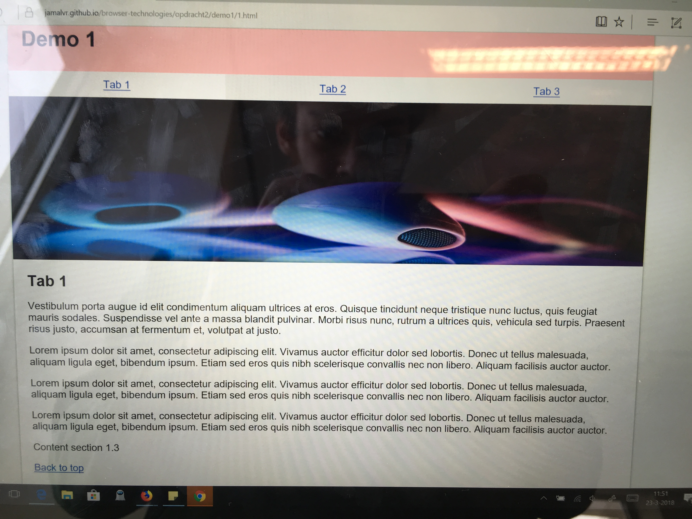

# Browser Technologies
// Robuuste, toegankelijke websites leren bouwen … 

* [Demo 1 - Tabs](https://jamalvr.github.io/browser-technologies/opdracht2/demo1/1.html)
* [Demo 2 - Modal](https://jamalvr.github.io/browser-technologies/opdracht2/demo2/2.html#)

## Opdracht 2 - 1, 2, 3 Feature Detectie

### CSS Feature: Object fit
Object fit is used to style images without losing their display ratios (see `object-fit: cover`). It is widely support by most modern browsers, IE and Edge are the only browsers that don't support `Object fit.`

[Can I use: Object fit](https://caniuse.com/#search=object-fit)


Images in older browsers that use `object-fit` are replaced with `height: auto;`. That way the images will keep the right display ratios with the cost of taking up more space.

```
@supports (object-fit: cover) { 
    .content img {
        max-height: auto;
    }
}
```

### CSS Feature: Display flex
Display flex is support every modern browser. 'Older' browser require their respective pre-fix.
* IE 10 -ms- 
* Chrome 21.0 -webkit-	
* Firefox 18.0 -moz-
* Safari 6.1 -webkit-

To prevent `display: flex;` from breaking when used by older browsers I also used the `@support` rule to have a fallback property. This is not necesserily needed since `display: flex` can easily be replaced by `display: block;`, since they use the same property name.

```
ul {
    list-style-type: none;
    padding: 0;
    margin: 0;
    display: inline-block;
    width: 100%;
    margin-bottom: -4px;
}

ul li {
    text-align: center;
    width: 33.333%;
    float: left;
}

/* flex support */
@supports (display: flex) {
    ul {
        display: flex;
        margin-bottom: 0;
    }

    ul li {
        flex-grow: 1;
        flex-basis: 0;
        width: auto;
        float: none;
    }
}
```

### Device lab
#### Demo 1
The first demo worked on three devices that I have tested in the device lab. The only problem was the `object-fit` css property when used by the windows tablet in the device lab. The images lost their display ratio which distored the images because they where forced to become shorter. This was fixed by adding the `@support` rule and defining fallback properties to define the right height for images when `object-fit` is not supported.




Thanks to the feature detection build in the Javascript, the core functionalities still work, even when Javascript or CSS is not fully supported. When Javascript fails, all the content will be placed in one long column with back to top buttons that are normally hidden.

```
if (document.body.classList && document.body.classList.contains) {
    var topKnop = document.getElementsByClassName('topknop');

    for (var i=0; i < topKnop.length; i++) {
        topKnop[i].classList.add('hidden');
    }
    
    function addStyle() { ... }

    function onTabClick { ... }
}
```

#### Demo 2


- Per feature: Zoek uit hoe je deze kunt testen. Verzamel uitleg en artikelen. Bouw een (kleine) progressive enhanced demo (zonder extra tools, gewoon in 1 HTML file, zo simpel mogelijk). Test de feature (en fallback) op verschillende browsers en het device lab.Let op: Gebruik van polyfills is niet toegestaan.l

- Post je 6 afzonderlijke demo’s op GitHub met uitleg in een README file. Wat is de feature, welke browsers/devices ondersteunen deze wel/niet, hoe zorg je dat de fallback nuttig is?

criteria
- 6 features zijn onderzocht en er is een demo gemaakt.
- De code staat in een repository op GitHub.
- Een Readme is toegevoegd met, per feature:
-		Een beschrijving van de feature.
-		Bronnen van uitleg en gebruikte artikelen.
-		Welke browsers/devices ondersteunen deze wel/niet.
-		Een beschrijving hoe de fallback werkt.

 