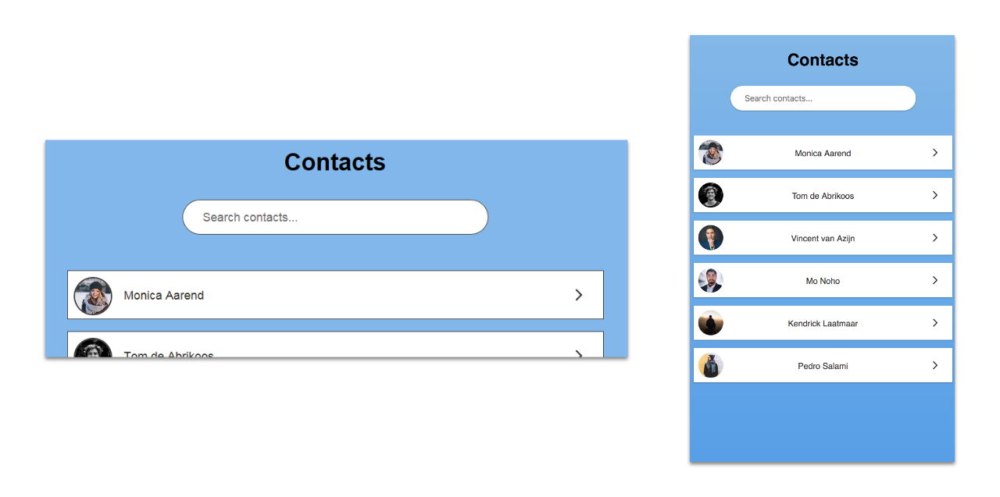

# Browser Technologies
// Robuuste, toegankelijke websites leren bouwen … 

## Opdracht 3 - Progressive Enhanced Browser Technologies 
**[KLIK HIER - Link naar de demo](https://jamalvr.github.io/browser-technologies/opdracht3/index.html)**

## De core funtionaliteit
Een lijst met contactpersonen waar op gefilterd kan worden aan de hand van een zoekbalk. Wanneer er op een contactpersoon geklikt wordt, kom je op een losse detailpagina met meer informatie over de desbetreffende persoon. Vanuit de detailpagina kan er contact opgenomen worden met de desbetreffende persoon of terug genavigeerd worden naar de homepagina.


### De opbouw
In eerst instantie wordt de zoekopdracht verstuurd via de server (in dit geval een nepserver met statische HTML). Vervolgens krijgt de gebruiker een lijst te zien met namen die aan de zoekopdracht voldoen. 

Om het geheel wat aantrekkelijker te maken is er vervolgens stijling toegevoegd aan de lijst elementen. De searchbar is nu aanzienlijk groter, zodat daar ook als eerste de aandacht naartoe gaat. De list-items zijn nu ook een stuk compacter waardoor er nu meer contactpersonen in de lijst komen te staan.

Als kers op de taart is er vervolgens een javascript functie toegevoegd. Met deze functie hoeft te gebruiker niet meer te wachten op de server om te filteren. Dit kan nu live gedaan worden wanneer de gebruiker wat in typt in de search bar.


## De features/Browser technologies
### [CSS Flexible Box Layout Module (Display: flex;)](https://css-tricks.com/snippets/css/a-guide-to-flexbox/)
Een layout module bedoelt voor het stijlen en positioneren van elementen. Het voordeel is dat er veel mogelijkheden zijn met relatief weinig code voor de positionering en stijling. De blokken met `display: flex;` verdeeld in een 'main-axis' en een 'cross-axis'. Hierdoor is het bijvoorbeeld erg makkelijk om elementen zowel verticaal `align-items: center;` als horizontaal `justify-content: center;` te positioneren.


```
.letter-list a {
    display: block;
}

.letter-list img:first-child {
    float: left;
}

.letter-list svg {
    float: right;
}

@supports (display: flex) {
    .letter-list a {
        display: flex;
        justify-content: space-between;
    }

    .letter-list svg { 
        align-self: end;
    }
}
```

### [Box-shadow](https://caniuse.com/#search=box-shadow)
`Box-shadow` wordt ondersteund in alle moderne browser. Alleen oudere versies voor IE9 bieden geen support. Om vooralsnog te spelen met CSS properties en er voor te zorgen dat ook oudere browsers en juiste user experience krijgen, zijn er borders toegevoegd wanneer de box-shadow niet beschikbaar is. Dit is gedaan met de `@support` regel op alle verschillende type `box-shadow` die zijn gebruikt.

```
.detailpage .main, input[type=search], .letter-list a {
    border: 1px solid #323232;
}

@supports (box-shadow: 0 1px 3px rgba(0,0,0,0.12), 0 1px 2px rgba(0,0,0,0.24)) {
    .detailpage main, input[type=search], .letter-list a {
        border: 1px solid #fff;
        box-shadow: 0 1px 3px rgba(0,0,0,0.12), 0 1px 2px rgba(0,0,0,0.24);
        -webkit-box-shadow: 0 1px 3px rgba(0,0,0,0.12), 0 1px 2px rgba(0,0,0,0.24);
        -moz-box-shadow: 0 1px 3px rgba(0,0,0,0.12), 0 1px 2px rgba(0,0,0,0.24);
    }
}
```

### [Viewport Units (VH)](https://caniuse.com/#search=vh)
Omdat ik een gradient `background` wil gebruiken en mijn lijst erg kort is, wil ik gebruik maken van `height: 100vh` zodat de body altijd de juiste hoogte heeft ongeacht de hoogte van de content. Om er voor te zorgen dat er altijd een achtergrond beschikbaar is, is er altijd een default background color aanwezig.



```
body {
    background: #7db9e8;
    font-family: sans-serif;
}

@supports (height: 100vh){
    body {
        background: -moz-linear-gradient(top, #7db9e8 1%, #7db9e8 1%, #47a0e5 100%); /* FF3.6-15 */
        background: -webkit-linear-gradient(top, #7db9e8 1%,#7db9e8 1%,#47a0e5 100%); /* Chrome10-25,Safari5.1-6 */
        background: linear-gradient(to bottom, #7db9e8 1%,#7db9e8 1%,#47a0e5 100%); /* W3C, IE10+, FF16+, Chrome26+, Opera12+, Safari7+ */
        filter: progid:DXImageTransform.Microsoft.gradient( startColorstr='#7db9e8', endColorstr='#47a0e5',GradientType=0 ); /* IE6-9 */
        height: 100vh;
    }
}
```

### [classList](https://caniuse.com/#search=classlist)
De `classList` property haalt de classes op van een DOM element. De `classList` property leest in eerst instantie alleen in welke classes er in het element zitten. Om classes toe te voegen of te verwijderen kan er bijvoorbeeld `.add` en `.remo` achter `classList` gezet worden. 

`classList` wordt ook goed gesupport in nieuwe browsers. Wanneer je naar browsers ouder dan IE10 gaat is er geen support meer voor de property.


Om er voor te zorgen dat de website niet breekt wanneer de `classList` property niet ondersteund wordt, is er een feature detect geschreven. Wanneer `classList` niet te vinden is in `document` valt de functionaliteit terug op de searchbar die via de server werkt.

```
if (document.documentElement.classList) {
    function searchFunction() {...
    }
}
```

## Browsersupport
#### IE8
Er gaat in IE8 heel wat basic styling en functionaliteit verloren. De Javascript functie werkt niet meer, de box-shadows zijn vervangen door borders en de max-width op het container element met de `margin: auto;` is ook verdwenen. Dit komt waarschijnlijk omdat ik een `main` HTML element heb gebruikt. Verder werkt het qua functionaliteit nog wel. De gebruiker krijgt vooralsnog een lijst met contacten te zien waarmee gefilterd kan worden.


#### IE9
De javascript functie wordt nog steeds niet ondersteund in IE9. Door de `main` aan te passen naar een `<div class="main">` wordt de stijling met de `max-width` en `margin: auto` nu wel meegenomen. De `box-shadow` property werkt hier alleen nog niet.


#### IE10
In IE10 werkt de `box-shadow` nog steeds niet. Dit komt hoogstwaarschijnlijk omdat de `@support` regel pas veel later gesupport wordt. Hierdoor zal de box-shadow alleen zichtbaar zijn in de nieuwere browsers die ook de `@support` regel ondersteunen. Verder werkt het qua javascript functionaliteit wel helemaal. Waarschijnlijk omdat `classList` wordt ondersteund vanaf IE10. 


### Major nieuwere browsers
Om te kijken hoe de moderne browsersupport is, heb ik gekeken hoe de app functioneert op alle moderne browsers. Over het algemeen werkt zo goed als alles. Het grootste probleem met moderne browsers, is dat ze niet altijd hetzelfde omgaan met CSS regels en andere ingebouwde browserstyles meegeven. De styling die de browsers meegeven kunnen in sommige gevallen in de weg staan van de stijling die je zelf als frontender/designer meegeeft. Het is daarom extra belangrijk om er op te letten dat bijvoorbeeld `:focus` states altijd duidelijk zijn. 

#### Chrome, Opera, Firefox, Edge & Safari
Op Safari werkt alles qua functionaliteit, op de stijling van het `input` element na. De searchbar gaat voor een gedeelte terug naar de originile stijling en verliest de extra hoogte en grotere `font-size`.


Op Edge werkt alles zoas het moet horen. Het enige wat qua contrast een probleem kan opleveren voor de accesability is de grijze kleur, die als achtergrond functioneert van de suggesties in de searchbar.


## Conclusie
In principe werkt de website op elk device. Er zijn vooral nog enkele stijl issues die op de website breken op verschillende browsers. De basis functionaliteit zou in theorie via de server moeten werken (dit is nu fake opgelost), maar de flow van de gebruiker is hetzelfde.

De CSS featuredetect op bijvoorbeeld `box-shadow` is niet perse heel zinvol omdat de support heel groot is, maar kon hierdoor wel goed met de `@support` rule spelen om er voor te zorgen dat het contrast van de knoppen altijd goed werkt. Het voornaamste nadeel van de `@support` regel is dat het pas relatief laat gesupport wordt. Eigenlijk is het voornamelijk zinvol om CSS feature detects te doen bij CSS regels die nieuwer zijn dan `@support`.

Progressive enhancement is toegepast op de website. Ik heb er voor gezorgd dat alles los van elkaar werkt en het is stapsgewijs verbeterd. De HTML structuur is netjes opgebouwd zodat er makkelijk CSS en Javascript toegevoegd kan worden.

 