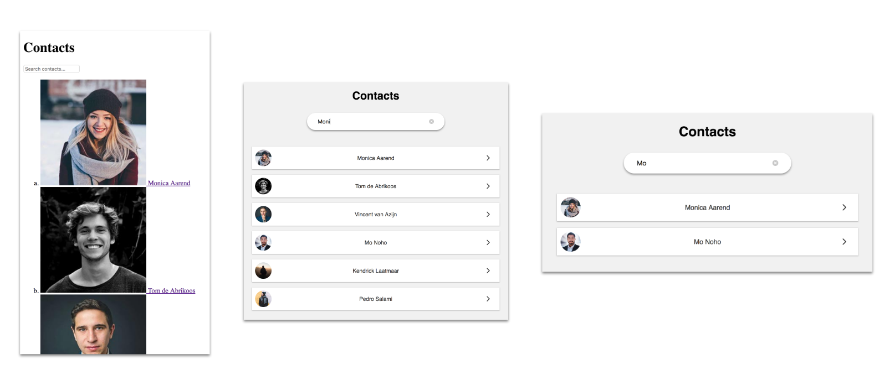

# Browser Technologies
// Robuuste, toegankelijke websites leren bouwen … 

## Opdracht 3 - Progressive Enhanced Browser Technologies 
Maak een demo op basis van een use case. Zorg dat alle gebruikers, met alle browsers, in iedere context minimaal de core functionaliteit te zien/horen/voelen krijgen. Bouw je demo in 3 lagen, volgens het principe van Progressive Enhancement. Gebruik als enhanced feature een (hippe, innovatieve, vooruitstrevende) Browser Technologie die je gaat onderzoeken op functionaliteit, toegankelijkheid en (browser) ondersteuning.

[Link naar de demo](https://jamalvr.github.io/browser-technologies/opdracht3/index.html)

## De core funtionaliteit
Een lijst met contactpersonen waar op gefilterd kan worden aan de hand van een zoekbalk. Wanneer er op een contactpersoon geklikt wordt, kom je op een losse detailpagina met meer informatie over de desbetreffende persoon. Vanuit de detailpagina kan er contact opgenomen worden met de desbetreffende persoon of terug genavigeerd worden naar de homepagina.

### De opbouw
In eerst instantie wordt de zoekopdracht verstuurd via de server (in dit geval een nepserver met statische HTML). Vervolgens krijgt de gebruiker een lijst te zien met namen die aan de zoekopdracht voldoen. 

Om het geheel wat aantrekkelijker te maken is er vervolgens stijling toegevoegd aan de lijst elementen. De searchbar is nu aanzienlijk groter, zodat daar ook als eerste de aandacht naartoe gaat. De list-items zijn nu ook een stuk compacter waardoor er nu meer contactpersonen in de lijst komen te staan.

Als kers op de taart is er vervolgens een javascript functie toegevoegd. Met deze functie hoeft te gebruiker niet meer te wachten op de server om te filteren. Dit kan nu live gedaan worden wanneer de gebruiker wat in typt in de search bar.

## De features/Browser technologies
### [CSS Flexible Box Layout Module (Display: flex;)](https://css-tricks.com/snippets/css/a-guide-to-flexbox/)
Een layout module bedoelt voor het stijlen en positioneren van elementen. Het voordeel is dat er veel mogelijkheden zijn met relatief weinig code voor de positionering en stijling. De blokken met ``display: flex;`` verdeeld in een 'main-axis' en een 'cross-axis'. Hierdoor is het bijvoorbeeld erg makkelijk om elementen zowel verticaal ``align-items: center;`` als horizontaal ``justify-content: center;`` te positioneren.

### [Box-shadow](https://caniuse.com/#search=box-shadow)
``Box-shadow`` wordt ondersteund in alle moderne browser. Alleen oudere versies voor IE9 bieden geen support. Om vooralsnog te spelen met CSS properties en er voor te zorgen dat ook oudere browsers en juiste user experience krijgen, zijn er borders toegevoegd wanneer de box-shadow niet beschikbaar is. Dit is gedaan met de ``@support`` regel op alle verschillende type ``box-shadow`` die zijn gebruikt.

### [classList](https://caniuse.com/#search=classlist)
De ``classList`` property haalt de classes op van een DOM element. De ``classList`` property leest in eerst instantie alleen in welke classes er in het element zitten. Om classes toe te voegen of te verwijderen kan er bijvoorbeeld ``.add`` en ``.remo`` achter ``classList`` gezet worden. 

``classList`` wordt ook goed gesupport in nieuwe browsers. Wanneer je naar browsers ouder dan IE10 gaat is er geen support meer voor de property.

## Browsersupport
### IE8 & IE9

### IE10

### Firefox 
Op de laatste versie van Firefox werkt alles naar behoren.

### Chrome

### Safari
Op safari werkt alles qua functionaliteit, op de stijling van het ``input`` element na. De searchbar gaat voor een gedeelte terug naar de originile stijling en verliest de extra hoogte en grotere ``font-size``.

Criteria
- De code staat in een repository op GitHub
- Er is een Readme toegevoegd met daarin beschreven:
- 	een beschrijving van de core functionality
- 	een beschrijving van de feature(s)/Browser Technologies
- 	welke browser de feature(s) wel/niet ondersteunen
- 	een beschrijving van de accessibility issues die zijn onderzocht
- De demo is opgebouwd in 3 lagen, volgens het principe van Progressive Enhancement
- De user experience van de demo is goed
- 	de leesbaarheidsregels zijn toegepast, contrast en kleuren kloppen
- 	het heeft een gebruiksvriendelijke interface, met gebruikmaking van affordance en feedback op de interactieve elementen
- Student kan uitleggen wat Progressive Enhancement en Feature Detectie is en hoe dit toe te passen in Web Development

 